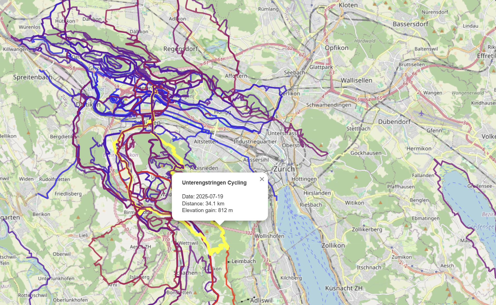

# garmin2map
Exports Garmin Connect activities of a certain type (e.g. cycling) as GPX files and generates a map showing all aggregated tracks. The tracks are color-coded based on elevation gain and grouped into layers by year.

